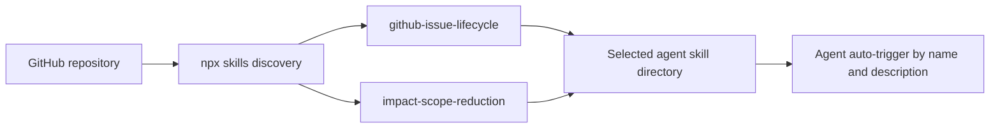
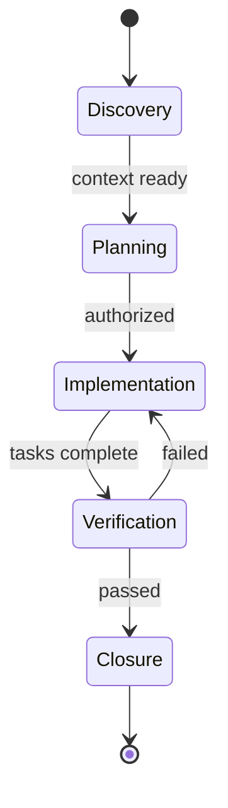

# Agent Skills Architecture

This repository packages two independent, agent-agnostic skills using the open Agent Skills specification and Vercel's `npx skills` discovery layout.

## Package layout

```text
skills/
├── github-issue-lifecycle/
│   ├── SKILL.md
│   └── references/
│       ├── github-access.md
│       ├── read-github-issues.md
│       ├── search-github-issues.md
│       ├── create-github-epic.md
│       ├── implement-github-epic.md
│       ├── update-github-issue.md
│       └── complete-github-task.md
└── impact-scope-reduction/
    └── SKILL.md
```

Every skill directory has a required `SKILL.md` with `name` and `description` frontmatter. Supporting files stay inside that directory so installers copy the complete skill.

## Discovery and installation



The standard `skills/<name>/SKILL.md` layout lets the CLI list both skills without an npm package, manifest, or agent-specific symlink script.

## Skill boundaries

### `github-issue-lifecycle`

Owns durable GitHub Issue tracking:

1. Read recent issue context.
2. Search for prior decisions and duplicate work.
3. Convert implementation plans into Epics with native sub-issues.
4. Track implementation with one task-level change summary.
5. Record progress, blockers, decisions, and handoffs.
6. Verify and close completed work.

The skill uses `gh` by default and a shared REST reference as fallback, with no agent-platform integration dependency. The entrypoint routes to one reference at a time so agents do not load every workflow for a single operation.

### `impact-scope-reduction`

Owns blast-radius control across the SDLC:

1. Identify the exact change and dependency scope.
2. Keep code responsibilities cohesive without speculative abstractions.
3. Expand focused tests according to contract, data, security, and compatibility risk.
4. Use environment-appropriate rollouts and restart the smallest safe unit.
5. Protect databases, caches, queues, and loaded AI models from unrelated disruption.
6. Verify both the changed service and unaffected dependencies.

This skill is self-contained because its workflow is short and has no conditional reference material.

## GitHub lifecycle



External GitHub writes remain subject to the request's authorization. Read-only discovery does not imply permission to create, comment on, edit, or close issues.

## Changelog

| Date | Change |
|:--|:--|
| 2026-04-12 | Created the GitHub Issue lifecycle workflows. |
| 2026-04-14 | Added resilient SDLC and impact-scope guidance. |
| 2026-08-25 | Converted Gemini/Antigravity modules into two portable Agent Skills: `github-issue-lifecycle` and `impact-scope-reduction`. |
