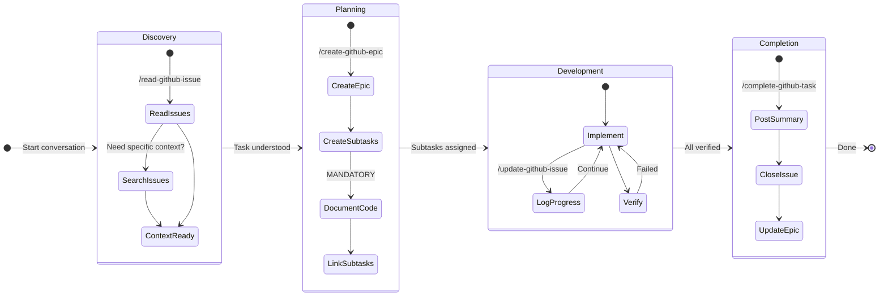
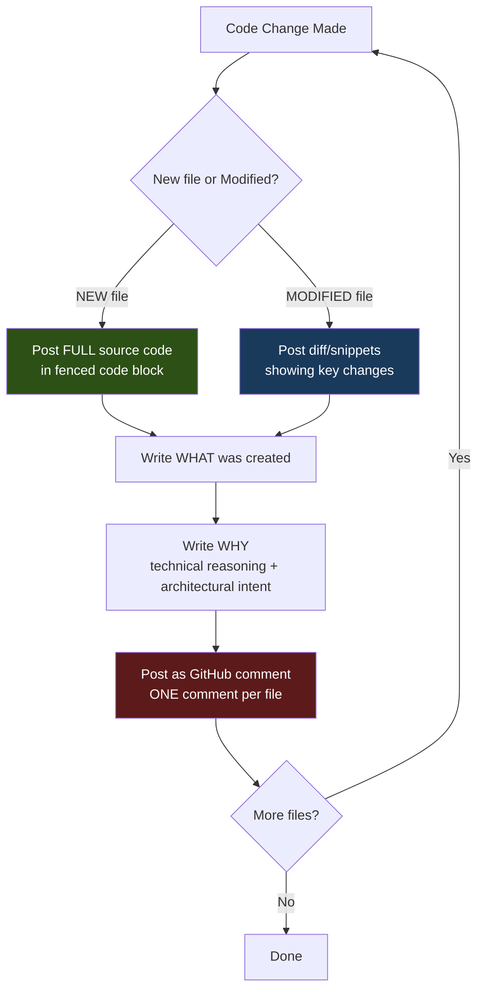
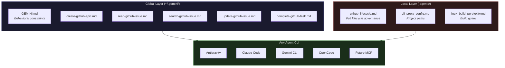

# GitHub Issue Lifecycle — Agent Workflow Architecture

> A portable, agent-agnostic system for tracking code changes through GitHub Issues.
> Designed to work with **Antigravity**, **Claude Code**, **Gemini CLI**, **OpenCode**, or any future **MCP-based agent**.

---

## 1. Overview

This document describes the complete architecture of the GitHub Issue Lifecycle system used across all projects. The system ensures every code change is documented, tracked, and discoverable through structured GitHub Issues.

### Design Principles
- **Global = Behavior** — GitHub lifecycle workflows apply to ALL repos
- **Local = Context** — Project-specific guards (build rules, config paths) stay local
- **1 File = 1 Comment** — Every file changed gets its own documented GitHub comment
- **Agent-Agnostic** — Portable across Antigravity, Claude Code, Gemini CLI, OpenCode, and MCP

---

## 2. File Structure (After Reorganization)

```
~/.gemini/                                    ← GLOBAL (all repos)
├── GEMINI.md                                 ← Behavioral rules
└── antigravity/global_workflows/
    ├── create-github-epic.md                 ← /create-github-epic
    ├── read-github-issue.md                  ← /read-github-issue
    ├── search-github-issue.md                ← /search-github-issue
    ├── update-github-issue.md                ← /update-github-issue
    └── complete-github-task.md               ← /complete-github-task

<any-repo>/.agents/                           ← LOCAL (project-specific)
├── rules/
│   ├── github_lifecycle.md                   ← Lifecycle governance
│   ├── cli_proxy_config.md                   ← Config path enforcement
│   └── linux_build_perplexity.md             ← Cross-compilation guard
└── workflows/
    └── (empty — all GitHub workflows are global)
```

---

## 3. Architecture Diagrams

### 3.1 Issue Lifecycle State Machine



### 3.2 MANDATORY Code Documentation Flow



### 3.3 Global vs Local Rule Resolution



### 3.4 Future MCP Server Architecture

```mermaid
flowchart LR
    subgraph MCP_SERVER["github-lifecycle-mcp"]
        direction TB
        T1["tool: create_epic<br><i>Plan → Epic + Subtasks</i>"]
        T2["tool: document_changes<br><i>File-by-file code comments</i>"]
        T3["tool: read_context<br><i>Gather issue history</i>"]
        T4["tool: log_progress<br><i>Update/blocker</i>"]
        T5["tool: close_task<br><i>Verify + close</i>"]
        T6["tool: search_issues<br><i>Keyword search</i>"]

        R1["resource: issue/{id}<br><i>Read issue details</i>"]
        R2["resource: epic/{id}/subtasks<br><i>List subtask statuses</i>"]

        P1["prompt: epic_template<br><i>Structured Epic body</i>"]
        P2["prompt: code_comment<br><i>File documentation format</i>"]
    end

    subgraph CLIENTS["Agent Clients"]
        C1["Antigravity"]
        C2["Claude Code"]
        C3["Gemini CLI"]
        C4["Cursor"]
        C5["OpenCode"]
    end

    CLIENTS <-->|"MCP Protocol<br>(stdio / SSE)"| MCP_SERVER
    MCP_SERVER <-->|"gh CLI / GitHub API"| GH["GitHub"]

    style MCP_SERVER fill:#0d1117,color:#c9d1d9,stroke:#30363d
    style CLIENTS fill:#161b22,color:#c9d1d9,stroke:#30363d
    style GH fill:#238636,color:#fff
```



---

## 4. Workflow Details

### `/create-github-epic` — Plan → Epic + Subtasks + Code Docs
1. Read `implementation_plan.md` artifact
2. Create Epic issue (full detail, not summarized)
3. Create Subtask issues linked to Epic
4. **MANDATORY**: Post 1 comment per file with code
5. Link all subtasks back to Epic

### `/read-github-issue` — Context Gathering
1. List 10 latest closed issues
2. List 10 latest open issues
3. Deep-dive specific issues if relevant
4. Summarize context for current task

### `/search-github-issue` — Historical Search
1. Define keyword from user request
2. Search via `gh issue list --search`
3. Fallback to local `grep` if needed
4. Deep-dive relevant results
5. Apply findings to implementation

### `/update-github-issue` — Progress / Blocker Logging
1. Draft update to temp file
2. Post comment via `gh issue comment`
3. Update dependency relationships if needed

### `/complete-github-task` — Verification + Close
1. Summarize work and changes
2. Attach verification proof
3. Comment + close the issue
4. Update Epic checklist

---

## 5. Portability Mapping

| Concept | Antigravity | Claude Code | Gemini CLI | OpenCode | MCP |
|:--------|:------------|:------------|:-----------|:---------|:----|
| **Global Rules** | `~/.gemini/GEMINI.md` | `~/.claude/CLAUDE.md` | `~/.gemini/GEMINI.md` | `~/.opencode/rules.md` | Server config |
| **Local Rules** | `.agents/rules/*.md` | `.claude/rules/*.md` | `.gemini/rules/*.md` | `.opencode/rules/*.md` | N/A (embedded) |
| **Workflows** | `global_workflows/*.md` | `.claude/commands/*.md` | `global_workflows/*.md` | N/A | `tools` |
| **Slash Commands** | `/create-github-epic` | `/create-github-epic` | `/create-github-epic` | N/A | `tool_call` |
| **Turbo/Auto-run** | `// turbo-all` | `allowedTools` | `// turbo-all` | N/A | `confirmation: false` |

---

## 6. Changelog

| Date | Action | Details |
|:-----|:-------|:--------|
| 2026-04-12 | Initial creation | Audited 10 files, identified 3 issues |
| 2026-04-12 | Migrated 4 workflows | `read/search/update/complete` → global |
| 2026-04-12 | Deduplicated GEMINI.md | Removed CLI recipe duplication |
| 2026-04-12 | Merged lifecycle rule | `github_issues_mandatory.md` → `github_lifecycle.md` |
| 2026-04-12 | Deleted deprecated files | 5 files removed from local `.agents/` |
